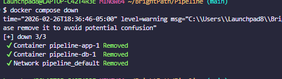
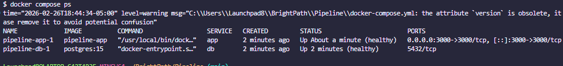
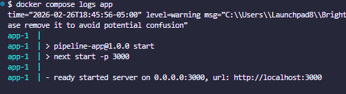

# Pipeline App : Local Docker Compose Setup

[](https://github.com/Nlewi-glitch089/Pipeline/actions/workflows/ci.yml)


This repository contains a minimal Next.js app plus a PostgreSQL service and a Docker Compose setup configured for reliable local development.

Quick features implemented to meet Level-10 look-fors:
- Multistage `Dockerfile` to produce a small production image.
- `docker-compose.yml` with `healthcheck` for Postgres and `depends_on` using service health.
- `restart: unless-stopped` for auto-recovery of critical services.
- `prisma` schema included and scripts to generate client and run migrations inside container.
- `secrets/` example files included to demonstrate Docker secrets for local development.

Getting started

1. Using Docker secrets (recommended local/dev secure approach)

 - Example secret files are provided in `secrets/` for local development. Replace with secure values in real environments.

```bash
docker compose build
docker compose up -d
```

2. Alternative (quick start using `.env`):

- Copy `.env.example` to `.env` and adjust secrets (not recommended for committing to VCS).

3. Generate Prisma client and run migrations inside the running app container:

```bash
docker compose exec app npm run prisma:generate
# For development migrations (creates migration files):
docker compose exec app npx prisma migrate dev --name init
# For applying production migrations:
docker compose exec app npm run prisma:migrate
```

Verify

- Check containers: `docker compose ps`
- Tail logs: `docker compose logs -f`
- Visit `http://localhost:3000`

See detailed troubleshooting drills: [TROUBLESHOOTING.md](TROUBLESHOOTING.md)

Troubleshooting / Failpoints

- Common errors and how I resolved them are collected in [FAILPOINTS.md](FAILPOINTS.md). Review that file for examples you can reference.

Secrets

- For CI/production use Docker secrets or your cloud provider secret manager.
- This repository includes example files under `secrets/` for local testing. Do NOT commit real secrets.
- `docker-compose.yml` is configured to mount secrets to `/run/secrets/<name>`. The app's entrypoint will load `DATABASE_URL` from `/run/secrets/database_url` if present.

Branching strategy (recommended for Level 10)

- Trunk-based approach with short-lived feature branches:
  - `main` (protected): always deployable; PRs required with at least one reviewer.
  - Feature branches: `feature/<ticket>-short-desc` created off `main` and merged via PR.
  - Release/Hotfix branches used rarely, merged back into `main` if used.

Why this helps teams

- Clear branch names and a PR process reduce merge conflicts and onboarding time.
- A protected `main` ensures CI runs and that builds are reproducible.

Notes on Compose healthchecks and `depends_on`

- This setup uses Compose `2.4` syntax to allow `depends_on` with a `service_healthy` condition so the `app` will wait for the `db` healthcheck to pass before starting.
- Some Compose versions differ; if your environment uses the newer Compose spec (v3+), you may instead implement an explicit wait (e.g., in the app entrypoint) or use a small wait script.

**Screenshots**

- **Command:** `docker compose down` — output captured after stopping services.
- **Evidence:**

  

- **Command:** `docker compose ps` — shows running containers and their status.
- **Evidence:**

  

- **Command:** `docker compose logs --tail=200 app` — shows recent app logs confirming the server started and handled requests.
- **Evidence:**

  

Use these images as evidence that the containers started, the database became healthy, and the app served requests on `http://localhost:3000`.

